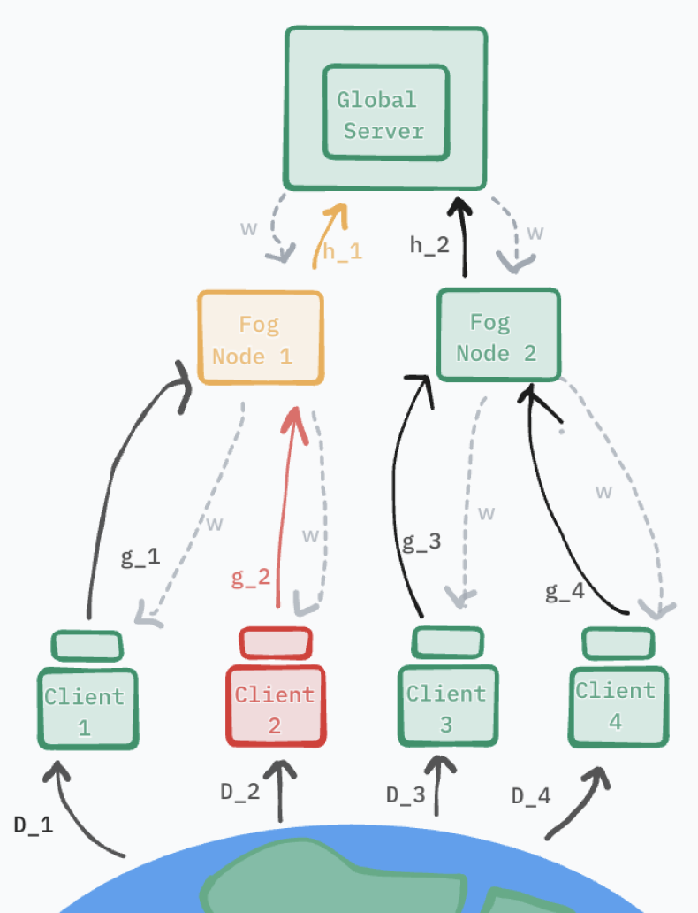

# Foggy Trust

By Emmanuel Rassou & Tomas Gonzalez


This repository contains the code for FoggyTrust, a hierarchical extension of
[FLTrust: Byzantine-Robust Federated Learning](https://arxiv.org/abs/2012.13995).


## Overview

FLTrust assumes the server owns a small, clean root dataset. At every round, the
server computes a trusted reference update from this root dataset, compares each
client update to that reference with cosine similarity, clips client update norms
to the trusted update norm, and averages only positively aligned updates.

FoggyTrust makes this trust mechanism hierarchical. Workers are first partitioned
into fog groups. Each fog node holds or receives trusted data for its group and
runs FLTrust locally, producing one robust fog-level update. The cloud server then
aggregates the fog-level updates. Because the first level has already converted
many worker updates into a smaller set of trusted fog updates, the second level is
modular: `--foggy_aggregation` can be swapped among implemented cloud rules such
as `fedavg`, `trimmed_mean`, `median`, `krum`, `scaffold`, and `fedadam`. This
lets the same FoggyTrust trust layer sit under stateful optimizers like FedAdam
or SCAFFOLD-style control-variate aggregation.



## Environment

The code uses MXNet 1.x / Gluon. The checked-in `requirements.txt` pins the
versions used for the current experiments.

```bash
cd /path/to/FoggyTrust
conda create -n fltrust python=3.9 -y
conda activate fltrust
pip install -r requirements.txt
```

For CPU-only runs, replace `mxnet-cu112==1.9.1` in `requirements.txt` with
`mxnet==1.9.1` before installing.

## Datasets

Supported datasets:

- `mnist`: downloaded automatically by MXNet on first use.
- `FashionMNIST`: downloaded automatically by MXNet on first use.
- `CIFAR-10`: downloaded automatically by GluonCV/MXNet.
- `SnapshotSafari`: local image dataset with a metadata JSON and image root.

MXNet stores downloaded datasets under `$MXNET_HOME/datasets` when `MXNET_HOME`
is set, otherwise under `~/.mxnet/datasets`.

To force a fresh MNIST/FashionMNIST download:

```bash
rm -rf "${MXNET_HOME:-$HOME/.mxnet}/datasets/mnist"
rm -rf "${MXNET_HOME:-$HOME/.mxnet}/datasets/fashion-mnist"
```

## Reproduce Experiments

Run all commands from the repository root. Use `--gpu -1` for CPU execution or
`--gpu 0` for the first GPU.

### 1. Smoke Test

This short run verifies the environment and data loading.

```bash
python test_foggytrust.py \
  --dataset mnist \
  --niter 5 \
  --nworkers 20 \
  --nbyz 4 \
  --byz_type trim_attack \
  --aggregation foggytrust \
  --foggy_aggregation fedavg \
  --gpu -1
```

### 2. Flat FLTrust Baseline

`test_byz_p.py` is the original one-level runner. It supports flat aggregators
such as `fltrust`, `fedavg`, `trimmed_mean`, `median`, `krum`, `scaffold`, and
`fedadam`.

```bash
python test_byz_p.py \
  --dataset mnist \
  --lr 0.01 \
  --batch_size 32 \
  --nworkers 100 \
  --nbyz 20 \
  --niter 2000 \
  --byz_type trim_attack \
  --aggregation fltrust
```

### 3. FoggyTrust With a Chosen Level-2 Aggregator

`test_foggytrust.py` fixes the topology to FoggyTrust: FLTrust at level 1
(`workers -> fog`) and the selected rule at level 2 (`fog -> cloud`).

```bash
python test_foggytrust.py \
  --dataset mnist \
  --lr 0.01 \
  --batch_size 32 \
  --nworkers 100 \
  --nbyz 20 \
  --niter 2000 \
  --byz_type trim_attack \
  --aggregation foggytrust \
  --foggy_aggregation fedavg
```

Swap the second-level method without changing the first-level FLTrust trust
filter:

```bash
python test_foggytrust.py --dataset mnist --byz_type trim_attack --foggy_aggregation fedadam
python test_foggytrust.py --dataset mnist --byz_type trim_attack --foggy_aggregation scaffold
```

### 4. Paper-Style Sweeps

`test_byz_all.py` runs the configured Cartesian sweep over attacks and
aggregators, writes one log per run under `logs_<dataset>/`, and stores resumable
checkpoints under `checkpoints/` by default.

The exact commands used to run each white paper experiment are listed in
[`experiments.md`](experiments.md). Use that file as the canonical reproduction
checklist for MNIST, Fashion-MNIST, Snapshot Safari, and CIFAR-10 experiments.

Flat baselines:

```bash
python test_byz_all.py \
  --dataset mnist \
  --lr 0.01 \
  --batch_size 32 \
  --nworkers 100 \
  --nbyz 20 \
  --niter 2000 \
  --runner flat \
  --max_workers 10
```

FoggyTrust:

```bash
python test_byz_all.py \
  --dataset mnist \
  --lr 0.01 \
  --batch_size 32 \
  --nworkers 100 \
  --nbyz 20 \
  --niter 2000 \
  --runner foggytrust \
  --max_workers 10
```

Flat and FoggyTrust in one launch:

```bash
python test_byz_all.py \
  --dataset SnapshotSafari \
  --lr 0.01 \
  --batch_size 64 \
  --nworkers 30 \
  --nbyz 6 \
  --niter 300 \
  --runner all \
  --fog_num_groups 3 \
  --snapshot_metadata_path ../data/snapshot/snapshot_safari_2024_metadata.json \
  --snapshot_images_root ../data/snapshot/images \
  --snapshot_subset_projects KAR,KRU,SER \
  --snapshot_min_category_frequency 20 \
  --snapshot_max_train_samples 12000 \
  --snapshot_max_test_samples 3000 \
  --snapshot_split_seed 7 \
  --max_workers 10
```

The submitted Slurm entry point is `run.sbatch`; it currently reproduces the
SnapshotSafari sweep above on one GPU.

## Logged Outputs

Experiment logs are written to dataset-specific directories such as
`logs_mnist/`, `logs_FashionMNIST/`, `logs_CIFAR-10/`, and
`logs_SnapshotSafari/`. Pairwise sweep logs are named
`<attack>__<aggregation>.txt`; FoggyTrust second-level aggregators appear as
`foggytrust(<method>)`, for example `trim_attack__foggytrust(fedadam).txt`.

Plot accuracy curves from any set of logs with:

```bash
python plotting/plot_accuracy.py \
  logs_mnist/trim_attack__fltrust.txt \
  "logs_mnist/trim_attack__foggytrust(fedavg).txt" \
  --output figures/mnist_trim_accuracy.png \
  --no-show
```

## Main Arguments

| Argument | Default | Description |
| --- | --- | --- |
| `--dataset` | `FashionMNIST` | Dataset: `mnist`, `FashionMNIST`, `CIFAR-10`, or `SnapshotSafari` |
| `--net` | `cnn` | Model family; resolved per dataset by `model_helper.py` |
| `--nworkers` | `100` | Number of clients |
| `--nbyz` | `20` | Number of Byzantine clients |
| `--byz_type` | `no` | Attack: `no`, `trim_attack`, `label_flipping_attack`, `scaling_attack`, `krum_attack`, or `adaptive_attack` |
| `--aggregation` | `fltrust` | Flat runner aggregation; `test_foggytrust.py` enforces `foggytrust` |
| `--foggy_aggregation` | `fedavg` | FoggyTrust level-2 fog-to-cloud aggregator |
| `--fog_num_groups` | dataset labels | Number of fog groups |
| `--fog_server_pc` | `server_pc` | Trusted fog-node data size per group |
| `--fog_server_pc_mode` | `replicated` | Trusted data layout: `replicated` or `partitioned` |
| `--lr` | `0.006` | Learning rate |
| `--batch_size` | `32` | Minibatch size per worker |
| `--niter` | `2500` | Training iterations |
| `--gpu` | `0` | GPU index; use `-1` for CPU |
| `--nrepeats` | `0` | Random seed |

## Repository Layout

- `test_byz_p.py`: flat federated learning runner and shared CLI/data helpers.
- `test_foggytrust.py`: hierarchical FoggyTrust runner.
- `test_byz_all.py`: reproducibility sweeps over attacks and aggregators.
- `foggytrust_aggregation.py`: first-level FLTrust group aggregation and
  second-level fog-to-cloud aggregators.
- `foggytrust_data.py`: worker, trusted-data, and fog-group partitioning.
- `nd_aggregation.py`: flat aggregation implementations.
- `byzantine.py`: Byzantine attack implementations.
- `plotting/plot_accuracy.py`: log parser and plotting utility.
- `run.sbatch`: cluster batch script for SnapshotSafari reproduction.
