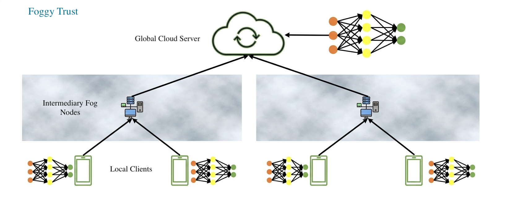

# Foggy Trust

By Emmanuel Rassou & Tomas Gonzalez



Demo implementation for **FLTrust: Byzantine-Robust Federated Learning** (NDSS 2021).  
Paper: [FLTrust: Byzantine-Robust Federated Learning](https://arxiv.org/abs/2012.13995)

## Overview

FLTrust uses a small clean root dataset held by the server as a trusted reference to assign trust scores to client updates via cosine similarity. This code simulates federated learning with MNIST/FashionMNIST, supports Byzantine attacks (e.g., trim attack), and aggregates updates using FLTrust.

## Requirements

- Python 3.7+
- MXNet 1.x (Gluon API)
- NumPy

## Setup

### Option A: Conda

```bash
# Create environment
conda create -n fltrust python=3.9 -y
conda activate fltrust

# Install dependencies
pip install mxnet>=1.9.0,<2.0.0 "numpy>=1.16.0,<2.0.0"
```

### Option B: uv

```bash
# Create project env and install (from project root)
uv venv
source .venv/bin/activate   # Linux/macOS
# or:  .venv\Scripts\activate  (Windows)

uv pip install -r requirements.txt
```

## Datasets

Supported datasets: **MNIST** and **FashionMNIST**.

Both are downloaded automatically via MXNet Gluon on first run. No manual download is needed.

- **Storage location**: When using `scripts/activate_env.sh`, `MXNET_HOME` is set to the project dir on scratch (`<project>/.mxnet/datasets/`) to avoid home-quota limits. Otherwise `~/.mxnet/datasets/`.
- **MNIST**: 60k train, 10k test images (28×28 grayscale digits)
- **FashionMNIST**: 60k train, 10k test images (28×28 grayscale clothing items)

To force a fresh download, remove the dataset directory (use `$MXNET_HOME/datasets/` if set, else `~/.mxnet/datasets/`):

```bash
rm -rf ${MXNET_HOME:-~/.mxnet}/datasets/mnist
rm -rf ${MXNET_HOME:-~/.mxnet}/datasets/fashion-mnist
```

## Running

The main entry point is `run.py`, which invokes the FLTrust script with default arguments:

```bash
python run.py
```

`run.py` executes:

```bash
python test_byz_p.py --dataset mnist --lr 0.01 --batch_size 32 --nworkers 100 --nbyz 20 --byz_type trim_attack
```

### Direct invocation

For custom runs, call `test_byz_p.py` directly:

```bash
python test_byz_p.py --dataset mnist --lr 0.01 --batch_size 32 --nworkers 100 --nbyz 20 --byz_type trim_attack
```

**Use FashionMNIST instead of MNIST:**

```bash
python test_byz_p.py --dataset FashionMNIST
```

### All Byzantine types (`test_byz_all.py`)

To run **every supported attack** with the **same** hyperparameters and collect test accuracy over time in a single table (for plotting or analysis), use:

```bash
python test_byz_all.py
```

Run this from the `FoggyTrust` directory (same as the other scripts). It sequentially calls `test_byz_p.main` for `no`, `trim_attack`, and `label_flipping_attack`, then prints array shapes for the stacked time series. **Command-line flags are the same as `test_byz_p.py`** (e.g. `--niter`, `--dataset`, `--gpu`); `--byz_type` is ignored here because each attack is run in turn. Example: `python test_byz_all.py --niter 30 --gpu -1`. For programmatic use, pass `base_args` into `build_byzantine_timeseries_table`.

### Main arguments

| Argument       | Default      | Description                         |
|----------------|--------------|-------------------------------------|
| `--dataset`    | FashionMNIST | Dataset: `mnist` or `FashionMNIST`  |
| `--nworkers`   | 100          | Number of clients                   |
| `--nbyz`       | 20           | Number of Byzantine (malicious) clients |
| `--byz_type`   | no           | Attack type: `no`, `trim_attack`, `label_flipping_attack` or `scaling_attack` |
| `--lr`         | 0.006        | Learning rate                       |
| `--batch_size` | 32           | Minibatch size per client           |
| `--niter`      | 2500         | Number of training iterations       |
| `--gpu`        | 0            | GPU index; use `-1` for CPU         |

## Files

- `run.py` — Main entry point
- `test_byz_all.py` — Run all Byzantine attack types with shared hyperparameters; tabular test-accuracy time series
- `test_byz_p.py` — Training loop, data loading, FLTrust orchestration
- `nd_aggregation.py` — FLTrust aggregation logic
- `byzantine.py` — Byzantine attack implementations
